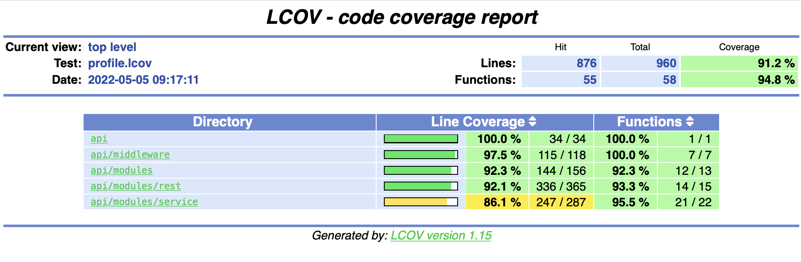
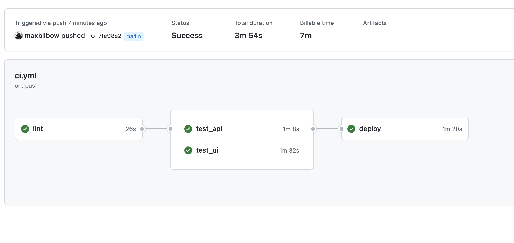

DnSO
====
***(Definitely not Stack Overflow)***

**Author:** *Max Bilbow*
**Heroku App:**: [bilbowm-sem2](https://bilbowm-sem2.herokuapp.com)

* [Getting Started](#getting-started)
  * [Initialise GitHooks](#initialise-githooks)
  * [Intall SDKs](#intall-sdks)
  * [Local Database Setup](#local-database-setup)
  * [IDE Setup](#ide-setup)
  * [Build and Launch](#build-and-launch)

* [Continuous Integration (CI)](#continuous-integration-ci)
  * [Analysis and Reports](#analysis-and-reports)
  * [Github Workflow](#github-workflow)

---

# Getting Started

## Initialise GitHooks
Open a terminal in the repository's root and run:
```bash
git config --local include.path ../.gitconfig
```

## Intall SDKs

* Deno (>=1.21)
* node (Current LTS) with NPM (>=8)

## Local Database Setup

You can of course use any mysql database. For simplicity, I recommend a simple containerised solution.

You will need to install podman to complete this setup. If you are on Windows, the same can be achieved with Docker (Just replace 'podman' with 'docker' in the commands below).

1. Create a network through which contains can communicate with eachother:
```shell
podman network create 7097_net
```

2. Start a simple MariaDB MySql instance:
```shell
podman run -dit -e MYSQL_ROOT_PASSWORD=p455w0rd\
 -v 7097-data:/var/lib/mysql\
 -v `pwd`/db:/scripts:ro\
 -p 3306:3306\
 --restart always\
 --network 7097_net\
 --name 7097_db mariadb
```

3. Initialise the database
Then we need to initialise the database. In a console, connect the the mariadb container:
```shell
podman exec -it 7097_db /bin/bash
```
Once connected, we need to create the database and users (Add `--empty` if you do not want to include examle data):
```shell
./scripts/setup.sh --empty
```
exit the container by typing `exit`

4. **(Optional)** Start a simple phpMyAdmin UI for easy DB inspection:
```shell
podman run -dit\
 -e PMA_ARBITRARY=1\
 -e PMA_HOST=7097_db\
 -e PMA_USER=root\
 -e PMA_PASSWORD=p455w0rd\
 -p 8000:80\
 --restart always\
 --network 7097_net\
 --name 7097_dbadmin phpmyadmin
```

## IDE Setup
The project has two roots, both of which include some useful vscode settings:
* [Main API](.)
* [SPA Root](./spa)

In VS Code, IDE assistance is more effective if the SPA Root is opened as a seperate workspace.

## Build and Launch

Run the following command:
```shell
deno task start
```

Deno tasks are listed in the [deno.json config file](./deno.json). Have look at the task named `start` if you want to understand what it is doing.

**WARNING:** *Deno Tasks are a new feature and may change drastically with future releases*

# Continuous Integration (CI)
## Analysis and Reports

Run the following command:
```shell
deno task serve-reports
```
If there are linting errors, the task will fail and errors will be displayed. If successful, you will see something like:
```
Writing directory view page.
Overall coverage rate:
  lines......: 74.8% (682 of 912 lines)
  functions..: 83.6% (46 of 55 functions)
Cleaning up
listening on port: 9000
```
Navigate to http://localhost:9000 to view detailed reports.



Screenshots from UI tests will be collected in [./api/test/ui/.screenshots/](./api/test/ui/.screenshots/)

Deno tasks are listed in the [deno.json config file](./deno.json). Have look at the task named `serve-reports` if you want to understand what it is doing.

## Github Workflow
Repository actions are available on [7097-faq](https://github.com/maxbilbow/7097-faq) and configured in [.github/workflows](./.github/workflows)

When pushed to main, CI tests will run and the app will be deployed ot heroku.

